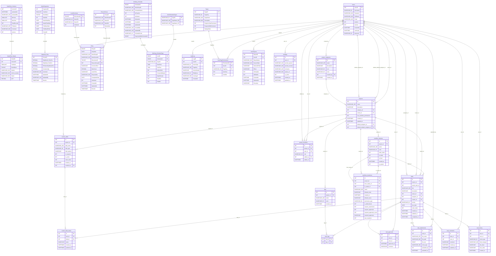

# ERD — Связи между таблицами

> Сгенерировано: 2026-04-08 21:13

```mermaid
erDiagram

    SalesPlan_Details {
        INT DetailID "PK"
        INT VersionID "FK"
        SMALLINT YearNum
        TINYINT MonthNum
        NVARCHAR_100 Market
        NVARCHAR_100 Article_number
        NVARCHAR_500 Name
        DECIMAL QTY
    }

    SalesPlan_Versions {
        INT VersionID "PK"
        DATETIME2 UploadedAt
        NVARCHAR_128 UploadedBy
        SMALLINT MinYear
        SMALLINT MaxYear
        INT TotalRecords
        NVARCHAR_255 FileName
        NVARCHAR_500 Comment
        BIT IsActive
    }

    Shipment_Plan {
        INT PeriodID "PK"
        DECIMAL ShipMonth_PlanPcs
        DECIMAL ShipWeek_PlanPcs
        DECIMAL FGStockStartWeekPcs
        DECIMAL ContainerQty
        NVARCHAR_500 Comment
        DATETIME2 UpdatedAt
        NVARCHAR_128 UpdatedBy
        TIMESTAMP RowVer
    }

    LossDirectness {
        TINYINT DirectnessID "PK"
        NVARCHAR_50 NameEn
        NVARCHAR_50 NameZh
        BIT IsDeleted
    }

    ReasonGroup {
        INT GroupID "PK"
        NVARCHAR_100 WorkShopID
        NVARCHAR_100 NameZh
        NVARCHAR_100 NameEn
        BIT DeleteMark
    }

    WeekSegments {
        INT SegmentID "PK"
        SMALLINT YearNum
        TINYINT MonthNum
        INT WeekNo
        DATE WeekStartDay
        DATE WeekFinishDay
        DATE FullWeekStart
        DATE FullWeekFinish
        INT PeriodID
    }

    custom_field_values {
        INT id "PK"
        INT task_id "FK"
        INT field_id "FK"
        NVARCHAR value
        DATETIME2 created_at
        DATETIME2 updated_at
    }

    custom_fields {
        INT id "PK"
        INT project_id "FK"
        NVARCHAR_255 field_name
        NVARCHAR_50 field_type
        NVARCHAR field_options
        BIT is_required
        BIT is_active
        INT order_index
        DATETIME2 created_at
        INT created_by "FK"
    }

    project_categories {
        INT id "PK"
        NVARCHAR_255 name
        NVARCHAR description
        NVARCHAR_50 icon
        NVARCHAR_50 color
        INT created_by "FK"
        DATETIME2 created_at
    }

    project_members {
        INT id "PK"
        INT project_id "FK"
        INT user_id "FK"
        NVARCHAR_50 role
        INT added_by "FK"
        DATETIME2 added_at
    }

    projects {
        INT id "PK"
        NVARCHAR_255 name
        NVARCHAR description
        INT category_id "FK"
        INT owner_id "FK"
        BIT has_workflow_permissions
        DATETIME2 created_at
        DATETIME2 updated_at
        INT default_assignee_id "FK"
        INT default_subtask_assignee_id "FK"
    }

    tags {
        INT id "PK"
        INT project_id "FK"
        NVARCHAR_100 name
        NVARCHAR_50 color
        DATETIME2 created_at
    }

    task_approvals {
        INT id "PK"
        INT task_id "FK"
        INT user_id "FK"
        DATETIME2 approved_at
        NVARCHAR comment
    }

    task_attachments {
        INT id "PK"
        INT task_id "FK"
        NVARCHAR_255 file_name
        NVARCHAR_500 file_path
        BIGINT file_size
        NVARCHAR_100 mime_type
        INT uploaded_by "FK"
        DATETIME2 uploaded_at
    }

    task_comments {
        INT id "PK"
        INT task_id "FK"
        INT user_id "FK"
        NVARCHAR comment
        DATETIME2 created_at
        DATETIME2 updated_at
    }

    task_history {
        INT id "PK"
        INT task_id "FK"
        INT user_id "FK"
        NVARCHAR_50 action_type
        NVARCHAR_100 field_changed
        NVARCHAR old_value
        NVARCHAR new_value
        DATETIME2 created_at
    }

    task_tags {
        INT task_id "PK"
        INT tag_id "PK"
    }

    tasks {
        INT id "PK"
        INT project_id "FK"
        INT parent_task_id
        NVARCHAR_500 title
        NVARCHAR description
        INT status_id "FK"
        INT assignee_id "FK"
        INT creator_id "FK"
        NVARCHAR_50 priority
        DATE due_date
        INT order_index
        DATETIME2 created_at
        DATETIME2 updated_at
        DATETIME2 completed_at
    }

    workflow_statuses {
        INT id "PK"
        INT project_id "FK"
        NVARCHAR_100 name
        NVARCHAR_50 color
        INT order_index
        BIT is_initial
        BIT is_final
        DATETIME2 created_at
        BIT is_system
    }

    workflow_transitions {
        INT id "PK"
        INT project_id "FK"
        INT from_status_id "FK"
        INT to_status_id "FK"
        NVARCHAR_100 name
        NVARCHAR allowed_roles
        DATETIME2 created_at
        NVARCHAR allowed_users
        NVARCHAR_20 permission_type
        BIT is_bidirectional
        BIT requires_attachment
        BIT requires_approvals
        INT required_approvals_count
        NVARCHAR required_approvers
        BIT auto_transition
    }

    Entry {
        BIGINT EntryID "PK"
        DATE OnlyDate
        NVARCHAR_100 WorkShopID
        NVARCHAR_100 WorkCenterID
        TINYINT DirectnessID "FK"
        INT ReasonGroupID "FK"
        NVARCHAR CommentText
        DECIMAL ManHours
        NVARCHAR ActionPlan
        NVARCHAR_200 Responsible
        DATE CompletedDate
        BIT IsDeleted
        DATETIME2 CreatedAt
        DATETIME2 UpdatedAt
        TIMESTAMP RowVer
    }

    Working_Schedule {
        BIGINT ScheduleID "PK"
        NVARCHAR_256 WorkShopID
        NVARCHAR_200 ScheduleName
        BIT IsFavorite
        BIT IsDeleted
        DATETIME2 DeletedAt
        DATETIME2 CreatedAt
        DATETIME2 UpdatedAt
        NVARCHAR_128 CreatedBy
        NVARCHAR_128 UpdatedBy
        NVARCHAR_10 ScheduleCode
        BIGINT SupersededByScheduleID
    }

    Working_ScheduleType {
        BIGINT LineID "PK"
        BIGINT ScheduleID "FK"
        NVARCHAR_50 TypeID "FK"
        TIME StartTime
        TIME EndTime
        BIT IsWorkShift
        BIT CrossesMidnight
        INT SpanMinutes
        INT StartMin
        INT EndMin
    }

    WorkScheduleTypes {
        NVARCHAR_50 TypeID "PK"
        NVARCHAR_100 TypeName_EN
        NVARCHAR_100 TypeName_ZH
    }

    AuditLog {
        INT LogID "PK"
        INT UserID "FK"
        NVARCHAR_50 ActionType
        NVARCHAR_100 PageKey
        NVARCHAR ActionDetails
        NVARCHAR_50 IPAddress
        NVARCHAR_500 UserAgent
        DATETIME CreatedAt
    }

    Pages {
        INT PageID "PK"
        NVARCHAR_50 PageKey
        NVARCHAR_100 PageName
        NVARCHAR_500 Description
        BIT RequiresViewPermission
        BIT RequiresEditPermission
        INT DisplayOrder
    }

    UserPagePermissions {
        INT PermissionID "PK"
        INT UserID "FK"
        NVARCHAR_50 PageKey "FK"
        BIT CanView
        BIT CanEdit
    }

    UserReports {
        INT ReportID "PK"
        INT UserID "FK"
        NVARCHAR_100 ReportName
        NVARCHAR_100 SourceTable
        NVARCHAR SelectedFields
        NVARCHAR Filters
        BIT IsTemplate
        BIT IsEditable
        DATETIME CreatedAt
        DATETIME UpdatedAt
        NVARCHAR Grouping
    }

    Users {
        INT UserID "PK"
        NVARCHAR_50 Username
        NVARCHAR_100 Password
        NVARCHAR_100 FullName
        NVARCHAR_100 Email
        BIT IsAdmin
        BIT IsActive
        DATETIME CreatedAt
        DATETIME LastLogin
        NVARCHAR_50 empcode
    }

    bindings {
        INT id "PK"
        INT user_id "FK"
        NVARCHAR_100 wechat_openid
        NVARCHAR_100 wechat_unionid
        NVARCHAR_100 nickname
        NVARCHAR_500 avatar_url
        BIT is_active
        DATETIME2 created_at
        DATETIME2 updated_at
    }

    Users ||--o{ AuditLog : "UserID"
    Users ||--o{ bindings : "user_id"
    custom_fields ||--o{ custom_field_values : "field_id"
    tasks ||--o{ custom_field_values : "task_id"
    Users ||--o{ custom_fields : "created_by"
    projects ||--o{ custom_fields : "project_id"
    LossDirectness ||--o{ Entry : "DirectnessID"
    ReasonGroup ||--o{ Entry : "ReasonGroupID"
    Users ||--o{ project_categories : "created_by"
    Users ||--o{ project_members : "added_by"
    projects ||--o{ project_members : "project_id"
    Users ||--o{ project_members : "user_id"
    project_categories ||--o{ projects : "category_id"
    Users ||--o{ projects : "default_assignee_id"
    Users ||--o{ projects : "default_subtask_assignee_id"
    Users ||--o{ projects : "owner_id"
    SalesPlan_Versions ||--o{ SalesPlan_Details : "VersionID"
    WeekSegments ||--o{ Shipment_Plan : "PeriodID"
    projects ||--o{ tags : "project_id"
    tasks ||--o{ task_approvals : "task_id"
    Users ||--o{ task_approvals : "user_id"
    tasks ||--o{ task_attachments : "task_id"
    Users ||--o{ task_attachments : "uploaded_by"
    tasks ||--o{ task_comments : "task_id"
    Users ||--o{ task_comments : "user_id"
    tasks ||--o{ task_history : "task_id"
    Users ||--o{ task_history : "user_id"
    tags ||--o{ task_tags : "tag_id"
    tasks ||--o{ task_tags : "task_id"
    Users ||--o{ tasks : "assignee_id"
    Users ||--o{ tasks : "creator_id"
    projects ||--o{ tasks : "project_id"
    workflow_statuses ||--o{ tasks : "status_id"
    Pages ||--o{ UserPagePermissions : "PageKey"
    Users ||--o{ UserPagePermissions : "UserID"
    Users ||--o{ UserReports : "UserID"
    projects ||--o{ workflow_statuses : "project_id"
    workflow_statuses ||--o{ workflow_transitions : "from_status_id"
    projects ||--o{ workflow_transitions : "project_id"
    workflow_statuses ||--o{ workflow_transitions : "to_status_id"
    Working_Schedule ||--o{ Working_ScheduleType : "ScheduleID"
    WorkScheduleTypes ||--o{ Working_ScheduleType : "TypeID"
```
